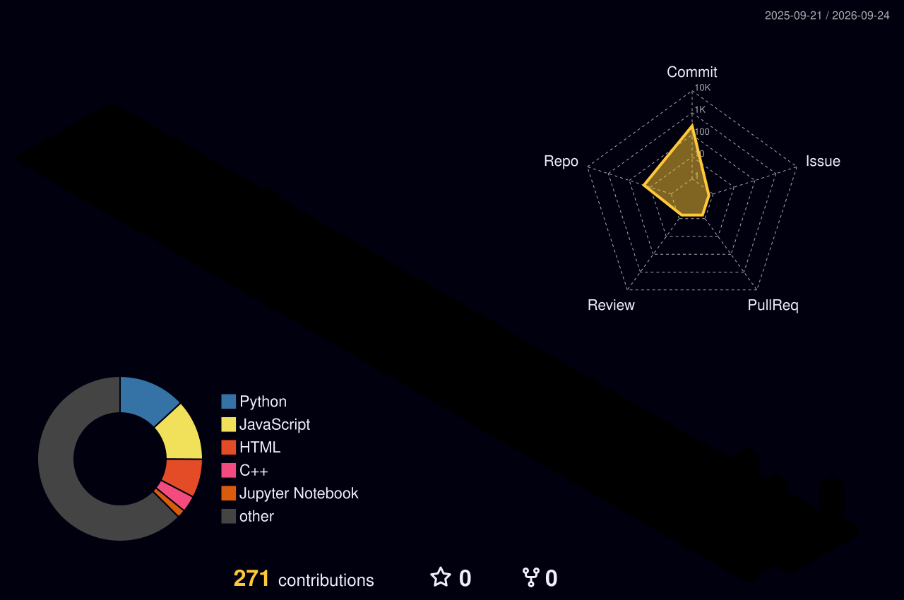

 

  

 

&nbsp;

&nbsp;

&nbsp;

 

 

<table align="center">
<tr>
<td align="center" width="160">
<h1>9</h1>
<b>USER ROLES</b> 
in one production system
</td>
<td align="center" width="160">
<h1>90+</h1>
<b>ROUTES</b> 
shipped and running
</td>
<td align="center" width="160">
<h1>2</h1>
<b>LANGUAGES</b> 
Bengali and English
</td>
<td align="center" width="160">
<h1>100%</h1>
<b>END TO END</b> 
design through deploy
</td>
</tr>
</table>

 

I build systems where several kinds of people use the same data for different reasons. An administrator, a field worker, a reviewer, and an end user each need a different view, different permissions, and different defaults. Designing that separation cleanly is the part I find most interesting, and it is where most systems get it wrong.

 

<table align="center">
<tr>
<td width="50%" valign="top">

**Missing data is shown as missing**

If a sensor has not reported, the interface says so. It never renders a zero, because a zero is a reading and an absence is not.

</td>
<td width="50%" valign="top">

**Permissions live where the data lives**

Scoping a user to their district is a query-layer constraint, not a filtered dropdown. If the rule only exists in the interface, it is not a rule.

</td>
</tr>
<tr>
<td width="50%" valign="top">

**Offline is a state, not an error**

Field forms queue locally and sync when connectivity returns. Endpoints are idempotent, so a retry never duplicates a record.

</td>
<td width="50%" valign="top">

**Scope boundaries are deliberate**

A monitoring platform I built has no remote control over the hardware it observes. Visibility was the goal; overriding safety logic was never in scope.

</td>
</tr>
</table>

 

<table align="center">
<tr>
<td align="center" width="180"><b>LANGUAGES</b></td>
<td></td>
</tr>
<tr>
<td align="center"><b>FRONTEND</b></td>
<td></td>
</tr>
<tr>
<td align="center"><b>BACKEND &amp; DATA</b></td>
<td></td>
</tr>
<tr>
<td align="center"><b>TOOLS</b></td>
<td></td>
</tr>
</table>

 

 

<table align="center">
<tr>
<td width="34%" valign="top" align="center">

**National IoT Monitoring**

9 roles · 90+ routes live telemetry ingestion offline field apps jurisdiction-scoped access

</td>
<td width="33%" valign="top" align="center">

**Competition Platform**

multi-role judging pipeline hybrid auto and manual evaluation live leaderboards

</td>
<td width="33%" valign="top" align="center">

**Institutional Governance**

document lifecycle review workflows immutable audit trail contribution scoring

</td>
</tr>
<tr>
<td valign="top" align="center">

**Data Intelligence**

ingestion pipeline sentiment classification trend and comparison dashboards

</td>
<td valign="top" align="center">

**Scheduling Systems**

separate portal per role approval workflow availability management calendar integration

</td>
<td valign="top" align="center">

**Design Systems**

component libraries design tokens responsive layouts accessibility

</td>
</tr>
</table>

 

  

  

 

 

 

<picture>
<source media="(prefers-color-scheme: dark)" srcset="https://raw.githubusercontent.com/SamaunRezvi/SamaunRezvi/output/github-contribution-grid-snake-dark.svg" />
<source media="(prefers-color-scheme: light)" srcset="https://raw.githubusercontent.com/SamaunRezvi/SamaunRezvi/output/github-contribution-grid-snake.svg" />

</picture>

 

 

&nbsp;

  

