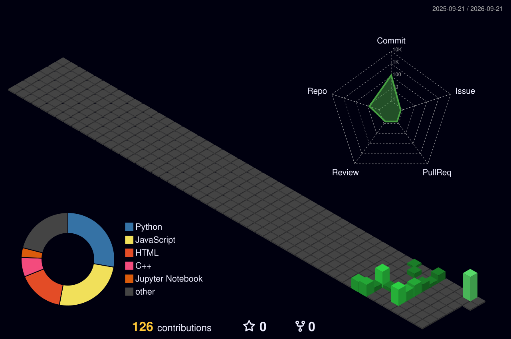

<table>
<tr><td>
&nbsp;🔴&nbsp;&nbsp;🟡&nbsp;&nbsp;🟢&nbsp;&nbsp;&nbsp;<code>·SAMAUN REZVI·&nbsp;</code>
</td></tr>
</table>

 

  

<h1>👋 Hi, I'm Samaun Rezvi</h1>

Computer Science &amp; Engineering · Daffodil International University · DSC, Dhaka, Bangladesh

  

&nbsp;

&nbsp;

&nbsp;

 

  

## 👤 About Me

<table align="center">
<tr>
<td align="center" width="170">
 
<h1>9</h1>
<b>USER ROLES</b> 
in a single system
</td>
<td align="center" width="170">
 
<h1>90+</h1>
<b>ROUTES</b> 
shipped and running
</td>
<td align="center" width="170">
 
<h1>2</h1>
<b>LANGUAGES</b> 
Bengali and English
</td>
<td align="center" width="170">
 
<h1>100%</h1>
<b>END TO END</b> 
design through deploy
</td>
</tr>
</table>

I build systems where people in different roles use the same data for different purposes. An administrator, a field worker, a reviewer, and an end user each need a different view, different permissions, and different defaults. Designing that separation cleanly is the part I find most interesting, and it is where most systems get it wrong.

<h3 align="center">Principles I Build On</h3>

<table align="center">
<tr>
<td width="50%" valign="top" align="left">

  
<b>Missing data is shown as missing</b> 
<code>renderQualityState()</code>

If a sensor has not reported, the interface says so. It never renders a zero, because a zero is a reading and an absence is not. Every value carries a quality state and an origin, so an estimate is never mistaken for a measurement.

</td>
<td width="50%" valign="top" align="left">

  
<b>Permissions live where the data lives</b> 
<code>scopeToJurisdiction()</code>

Scoping a user to their district is a query-layer constraint, not a filtered dropdown. If the rule only exists in the interface, it is not a rule. Authorisation is re-checked inside every server action.

</td>
</tr>
<tr>
<td width="50%" valign="top" align="left">

  
<b>Offline is a state, not an error</b> 
<code>queueAndSync()</code>

Field forms queue locally and sync when connectivity returns. Endpoints are idempotent, so a retried submission never duplicates a record. Maps fall back to a list view when tiles fail.

</td>
<td width="50%" valign="top" align="left">

  
<b>Scope boundaries are deliberate</b> 
<code>defineBoundary()</code>

A monitoring platform I built has no remote control over the hardware it observes. Centralising visibility was the goal; overriding on-site safety logic was never in scope, and saying so explicitly mattered more than shipping a feature.

</td>
</tr>
</table>

  

 

 

---

---

<h2 align="center">🧰 Tech &amp; Tools</h2>

 

<table align="center">
<tr>
<td align="right" valign="middle" width="200">
 
<b><code>Languages</code></b>
</td>
<td align="left" valign="middle">

</td>
</tr>
<tr><td colspan="2"></td></tr>
<tr>
<td align="right" valign="middle">
 
<b><code>Frontend</code></b>
</td>
<td align="left" valign="middle">

</td>
</tr>
<tr><td colspan="2"></td></tr>
<tr>
<td align="right" valign="middle">
 
<b><code>Backend-Data</code></b>
</td>
<td align="left" valign="middle">

</td>
</tr>
<tr><td colspan="2"></td></tr>
<tr>
<td align="right" valign="middle">
 
<b><code>Architecture</code></b>
</td>
<td align="left" valign="middle">

</td>
</tr>
<tr><td colspan="2"></td></tr>
<tr>
<td align="right" valign="middle">
 
<b><code>Tooling</code></b>
</td>
<td align="left" valign="middle">

</td>
</tr>
</table>

 

---

---

<h2 align="center">💼 Selected Work</h2>

 

<table align="center">
<tr>
<td width="34%" valign="top" align="left">

  
<b><code>iot-monitoring/</code></b>

Real-time telemetry across a 9-role permission system and 90+ routes. Offline-capable field apps, jurisdiction-scoped access control.

</td>
<td width="33%" valign="top" align="left">

  
<b><code>competition-platform/</code></b>

Multi-role judging pipeline blending automated scoring with manual review. Live leaderboards, role-separated submission flow.

</td>
<td width="33%" valign="top" align="left">

  
<b><code>institutional-governance/</code></b>

Full document lifecycle management: review workflows, an immutable audit trail, and weighted contribution scoring.

</td>
</tr>
<tr>
<td valign="top" align="left">

  
<b><code>data-intelligence/</code></b>

Ingestion-to-insight pipeline with sentiment classification, trend comparison, and dashboarded reporting.

</td>
<td valign="top" align="left">

  
<b><code>scheduling-systems/</code></b>

Role-specific portals with approval workflows, availability management, and calendar-synced booking.

</td>
<td valign="top" align="left">

  
<b><code>design-systems/</code></b>

Component libraries and design tokens driving consistent, accessible, responsive interfaces.

</td>
</tr>
</table>

 

---

## 📊 GitHub Activity

 

  

  

---

## 🧊 Contribution Landscape

 

---

## 🏆 Trophies

 

---

##  📊 Contribution 

 

<picture>
<source media="(prefers-color-scheme: dark)" srcset="https://raw.githubusercontent.com/SamaunRezvi/SamaunRezvi/output/github-contribution-grid-snake-dark.svg" />
<source media="(prefers-color-scheme: light)" srcset="https://raw.githubusercontent.com/SamaunRezvi/SamaunRezvi/output/github-contribution-grid-snake.svg" />

</picture>

---

<h2 align="center">💬 Words To Code By</h2>

 

 

 

  

 

---

<h2 align="center">📬 Get In Touch</h2>

 

 

<table align="center">
<tr>
<td align="center" width="33%">
  
<b><code>Full-time</code></b>

Frontend, Full-Stack, and Product Engineering

</td>
<td align="center" width="33%">
  
<b><code>Freelance</code></b>

Platforms, Dashboards,   and Interface Work

</td>
<td align="center" width="33%">
  
<b><code>Collaboration</code></b>

Open source, Side Builds, and Team Projects

</td>
</tr>
</table>

  

&nbsp;&nbsp;

  

 

