
 

<table>
<tr><td>
&nbsp;🔴&nbsp;&nbsp;🟡&nbsp;&nbsp;🟢&nbsp;&nbsp;&nbsp;<code>·SAMAUN REZVI·&nbsp;</code>
</td></tr>
</table>

 

<table>
<tr>

<td width="430" valign="top" align="left">

<h1><picture><source media="(prefers-color-scheme: dark)" srcset="assets/headings/hero-name-dark.svg"></picture></h1>

Computer Science &amp; Engineering · Daffodil International University · DSC, Dhaka, Bangladesh

  

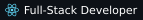
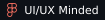
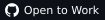

  

<b>│ Connect with Me</b>

  

&nbsp;

&nbsp;

&nbsp;

  

<b>│ Core Stack</b>

  

 

  

<i>status: open to opportunities · response time: usually within a day</i>

</td>

<td width="340" valign="middle" align="center">

</td>

</tr>
</table>

<h2 align="center"><picture><source media="(prefers-color-scheme: dark)" srcset="assets/headings/about-me-dark.svg"></picture></h2>

<table align="center">
<tr>
<td align="center" width="170">
 
<h1 align="center"><picture><source media="(prefers-color-scheme: dark)" srcset="assets/headings/stat-projects-dark.svg"></picture></h1>
<b>PROJECTS</b> 
across web and data
</td>
<td align="center" width="170">
 
<h1 align="center"><picture><source media="(prefers-color-scheme: dark)" srcset="assets/headings/stat-stack-dark.svg">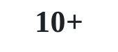</picture></h1>
<b>TECHNOLOGIES</b> 
in active use
</td>
<td align="center" width="170">
 
<h1 align="center"><picture><source media="(prefers-color-scheme: dark)" srcset="assets/headings/stat-reach-dark.svg">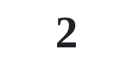</picture></h1>
<b>LANGUAGES</b> 
Bengali and English
</td>
<td align="center" width="170">
 
<h1 align="center"><picture><source media="(prefers-color-scheme: dark)" srcset="assets/headings/stat-ownership-dark.svg"></picture></h1>
<b>END TO END</b> 
design through deploy
</td>
</tr>
</table>

I build systems where people in different roles use the same data for different purposes. An administrator, a field worker, a reviewer, and an end user each need a different view, different permissions, and different defaults. Designing that separation cleanly is the part I find most interesting, and it is where most systems get it wrong.

<h3 align="center"><picture><source media="(prefers-color-scheme: dark)" srcset="assets/headings/principles-dark.svg"></picture></h3>

<!-- CARDS:principles:START -->

<!-- CARDS:principles:END -->

  

 

<i>full-stack web platforms · dashboards and admin tools · offline-capable applications · clean and reliable data models</i>

 

---

<h2 align="center"><picture><source media="(prefers-color-scheme: dark)" srcset="assets/headings/tech-and-tools-dark.svg"></picture></h2>

<i>stack · what I reach for and why</i>

 

<table align="center">
<tr>
<td align="right" valign="middle" width="200">
 
<b><code>Languages</code></b>
</td>
<td align="left" valign="middle">

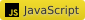

</td>
</tr>
<tr>
<td align="right" valign="middle">
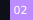 
<b><code>Frontend</code></b>
</td>
<td align="left" valign="middle">
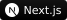
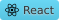

</td>
</tr>
<tr>
<td align="right" valign="middle">
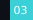 
<b><code>Backend-Data</code></b>
</td>
<td align="left" valign="middle">
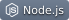

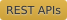

</td>
</tr>
<tr>
<td align="right" valign="middle">
 
<b><code>Architecture</code></b>
</td>
<td align="left" valign="middle">

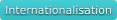

</td>
</tr>
<tr>
<td align="right" valign="middle">
 
<b><code>Tooling</code></b>
</td>
<td align="left" valign="middle">

</td>
</tr>
</table>

 

<i>The stack serves the problem, not the resume.</i>

---

<h2 align="center"><picture><source media="(prefers-color-scheme: dark)" srcset="assets/headings/selected-work-dark.svg"></picture></h2>

<i>work · repositories private · architecture walkthrough on request</i>

 

<!-- CARDS:work:START -->

<!-- CARDS:work:END -->

 

---

<h2 align="center"><picture><source media="(prefers-color-scheme: dark)" srcset="assets/headings/latest-projects-dark.svg"></picture></h2>

 

<!-- RECENT_PROJECTS:START -->

Live demos: <a href="https://studiospace-creators.vercel.app">StudioSpace</a> · <a href="https://assignment-seven-sigma-ten.vercel.app">BazarDor</a> · <a href="https://assignment-six-one-gamma.vercel.app">FitLog</a> · <a href="https://assignment-five-six.vercel.app">Dev Stack Builder</a>

<!-- RECENT_PROJECTS:END -->

 

---

<h2 align="center"><picture><source media="(prefers-color-scheme: dark)" srcset="assets/headings/github-activity-dark.svg"></picture></h2>

 

  

 

---

<h2 align="center"><picture><source media="(prefers-color-scheme: dark)" srcset="assets/headings/contribution-landscape-dark.svg"></picture></h2>

 

---

<h2 align="center"><picture><source media="(prefers-color-scheme: dark)" srcset="assets/headings/commit-habits-dark.svg"></picture></h2>

 

---

<h2 align="center"><picture><source media="(prefers-color-scheme: dark)" srcset="assets/headings/contribution-snake-dark.svg"></picture></h2>

 

<picture>
<source media="(prefers-color-scheme: dark)" srcset="https://raw.githubusercontent.com/SamaunRezvi/SamaunRezvi/output/github-contribution-grid-snake-dark.svg" />
<source media="(prefers-color-scheme: light)" srcset="https://raw.githubusercontent.com/SamaunRezvi/SamaunRezvi/output/github-contribution-grid-snake.svg" />

</picture>

---

<h2 align="center"><picture><source media="(prefers-color-scheme: dark)" srcset="assets/headings/words-to-code-by-dark.svg"></picture></h2>

<i>five lines I keep coming back to</i>

 

 

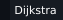

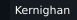
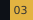
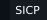

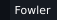

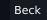

  

---

<h2 align="center"><picture><source media="(prefers-color-scheme: dark)" srcset="assets/headings/get-in-touch-dark.svg"></picture></h2>

<i>contact · usually reply within a day</i>

 

 

<table align="center">
<tr>
<td align="center" width="33%">
  
<b><code>Full-time</code></b>

Frontend, Full-Stack, and Product Engineering

</td>
<td align="center" width="33%">
  
<b><code>Freelance</code></b>

Platforms, Dashboards,   and Interface Work

</td>
<td align="center" width="33%">
  
<b><code>Collaboration</code></b>

Open source, Side Builds, and Team Projects

</td>
</tr>
</table>

  

&nbsp;&nbsp;

  

---

  

Personal use only, with visible credit to <b>Samaun Rezvi</b> · Banner artwork belongs to its original creator · <a href="./LICENSE">LICENSE</a>

